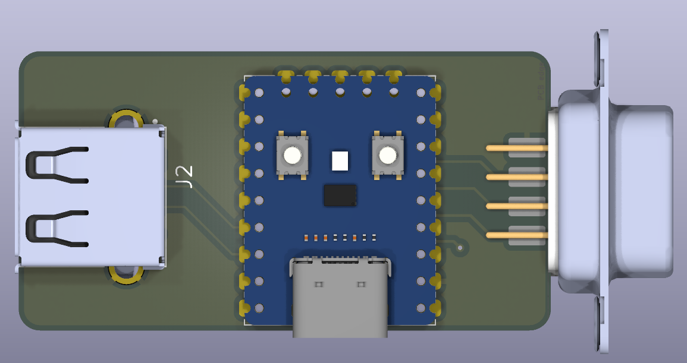
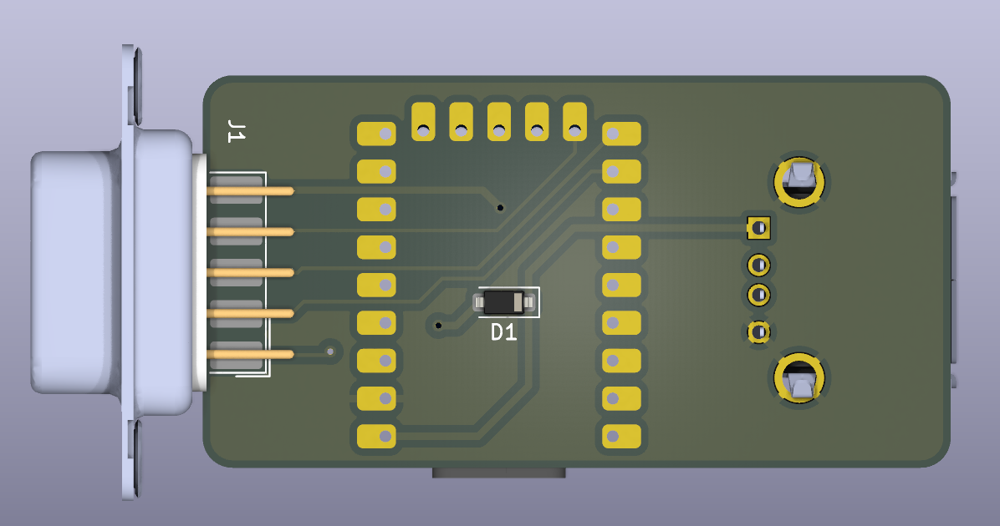

# The Retro Hacker RetroLink

RetroLink is an open-source hardware and firmware project for connecting modern USB HID joysticks and mice to classic MSX computers through the MSX DB9 General Purpose port.

The first hardware revision uses an RP2040 Zero module on a custom adapter board with:

- USB-A host connector for the USB HID device.
- DB9 connector for the MSX joystick/general purpose port.
- MSX DB9 pin 5 as the installed adapter power source.
- 1N5819 Schottky diode protection to prevent USB-C programming power from backfeeding the MSX.

## PCB Preview

Top view of hardware revision `1.00` (3D render):



Bottom view of hardware revision `1.00` (3D render):



## Versions

| Area | Version |
| --- | --- |
| Specification | `1.00` |
| Firmware | `1.00` |
| Hardware revision | `1.00` |

See [docs/specification.md](docs/specification.md) for the current technical specification and [docs/log.md](docs/log.md) for the version change log.

## Repository Layout

| Path | Purpose |
| --- | --- |
| [software](software) | RP2040 firmware source code using the Raspberry Pi Pico SDK, TinyUSB, and Pico-PIO-USB. |
| [firmware](firmware) | Generated UF2 firmware artifacts. |
| [hardware](hardware) | KiCad hardware project files by hardware revision. |
| [images](images) | PCB preview renders used in this README. |
| [docs](docs) | Technical specification and version log. |
| [third_party/Pico-PIO-USB](third_party/Pico-PIO-USB) | Git submodule for GPIO-based USB host support on RP2040. |

## Firmware Build

Initialize submodules after cloning:

```powershell
git submodule update --init --recursive
```

Build from the firmware source folder:

```powershell
cd software
make
```

The build generates a versioned UF2 file:

```text
firmware/retrolink-1.00.uf2
```

The Makefile defaults to the local Pico SDK-managed toolchain paths used on the development machine. Override `PICO_SDK_PATH`, `PICO_TOOLCHAIN_PATH`, `CMAKE`, `CMAKE_MAKE_PROGRAM`, `PYTHON3_EXECUTABLE`, `PICOTOOL_DIR`, `PIOASM_DIR`, or `PICO_PIO_USB_PATH` if your toolchain is installed elsewhere.

## Current Firmware Behavior

Firmware version `1.00` decodes standard USB HID joystick/gamepad axes, hats, and buttons into six active-low MSX outputs: GPIO6-9 for up/down/left/right, GPIO10 for button A, and GPIO11 for button B. Button usages 1 and 2 map to A and B. Outputs release to high impedance when inactive. USB-C CDC provides diagnostics, and the RP2040 Zero status LED pulses on newly asserted controls. See [software/README.md](software/README.md#current-behavior) for supported layouts, decoder limits, and tests; physical controller/MSX validation remains required.

The current status LED implementation assumes the common RP2040 Zero onboard WS2812-compatible LED on GPIO 16. Validate this against the exact board variant before treating the build as hardware-final.

## Hardware Status

Hardware revision `1.00` now includes the KiCad project, schematic, PCB layout, and generated assembly/fabrication outputs:

- [hardware/1.00/retrolink.kicad_pro](hardware/1.00/retrolink.kicad_pro)
- [hardware/1.00/retrolink.kicad_sch](hardware/1.00/retrolink.kicad_sch)
- [hardware/1.00/retrolink.kicad_pcb](hardware/1.00/retrolink.kicad_pcb)
- [Interactive BOM (iBOM)](hardware/1.00/bom/ibom.html)
- [Exported component BOM](hardware/1.00/production/bom.csv)
- [Production outputs](hardware/1.00/production)

GitHub displays the iBOM HTML as a repository file, not an interactive page. Download the raw HTML or open the local file in a browser to use its component highlighting and assembly checklist.

**Not yet electrically validated:** the exported BOM contains only the four components listed below. It does not include BSS138 level shifters, 10 kOhm pull-ups, USB data-line passives/ESD protection, or a separate VBUS current limiter. Review the PCB against the [specification](docs/specification.md) before manufacture or connection to an MSX. RP2040 GPIOs are not 5 V tolerant; firmware high-impedance release does not replace level shifting.

## PCB Components

Quantities are per PCB, taken from the current [production BOM](hardware/1.00/production/bom.csv). AliExpress links are search placeholders, not verified product recommendations; replace them with selected listings after checking dimensions, pinout, package, and electrical ratings. Availability and seller quality have not been verified.

| Reference | Component / BOM value | Quantity | PCB footprint / selection notes | AliExpress |
| --- | --- | --- | --- | --- |
| RZ1 | RP2040 Zero module | 1 | `RP2040-Zero`; check module dimensions and pinout against the PCB. | [Search RP2040 Zero](https://www.aliexpress.com/w/wholesale-rp2040-zero.html) |
| J1 | DE9 female socket (`DE9_Socket`) | 1 | `DSUB-9_Socket_EdgeMount_P2.77mm`; edge-mount, 2.77 mm pitch. Verify contact gender and mounting geometry. | [Search DB9 female edge-mount](https://www.aliexpress.com/w/wholesale-db9-female-edge-mount.html) |
| J2 | USB-A receptacle (`USB_A`) | 1 | `TE_6364372-2`; verify signal pins, shell tabs, and mounting dimensions. | [Search USB-A PCB socket](https://www.aliexpress.com/w/wholesale-usb-type-a-female-pcb.html) |
| D1 | Schottky diode (`1N5819` BOM value) | 1 | `D_SOD-123`; the selected part must fit SOD-123. A common axial DO-41 1N5819 will not fit; confirm the exact SMD part, ratings, and polarity before ordering. | [Search 1N5819 SOD-123](https://www.aliexpress.com/w/wholesale-1n5819-sod-123.html) |

This table describes the current PCB export, not a complete implementation of the specification's protection requirements. Use the iBOM for placement, and regenerate assembly outputs after hardware changes.
