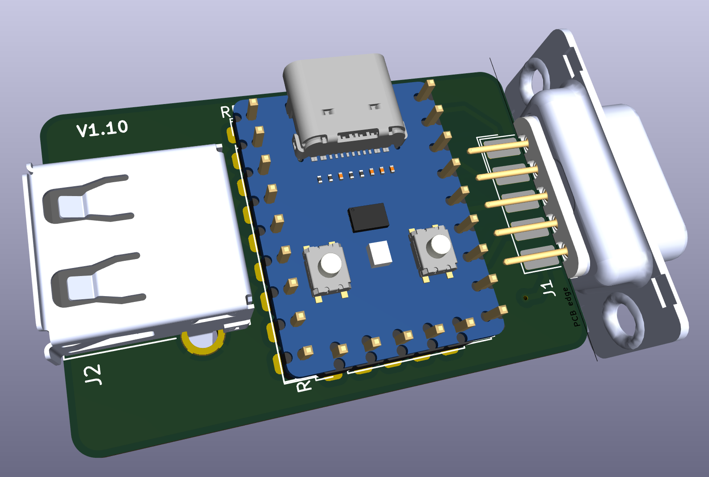
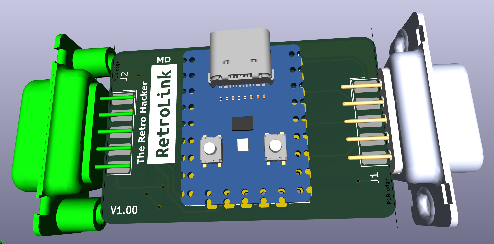
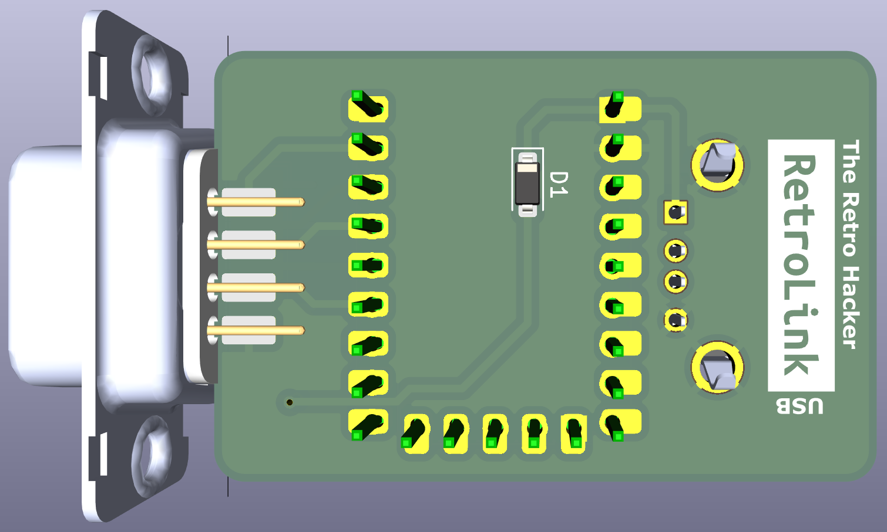
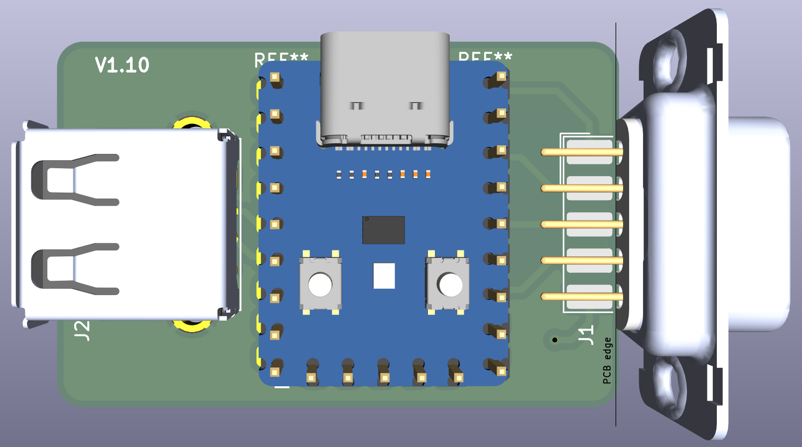
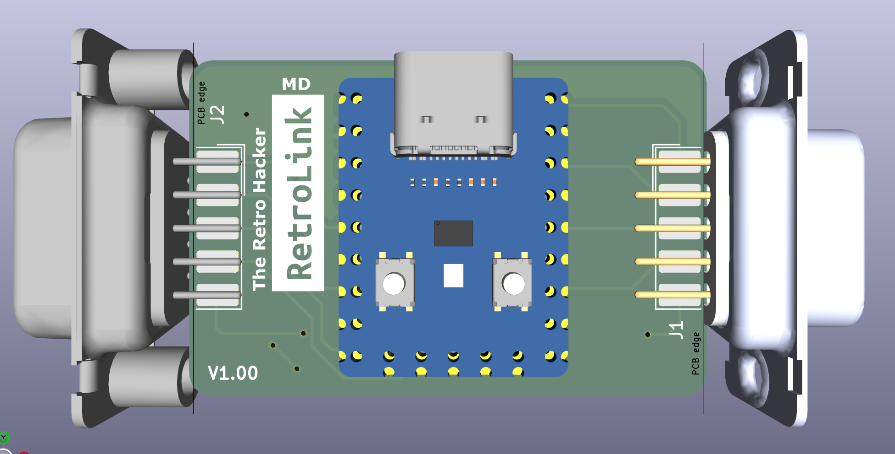
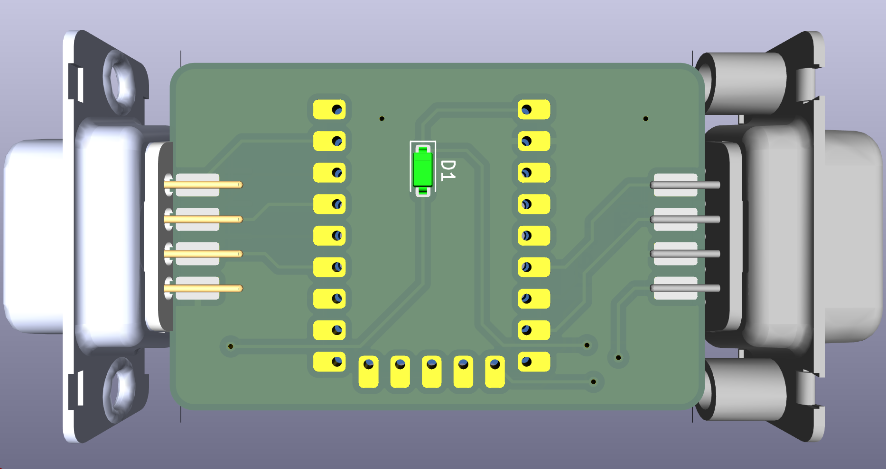

# The Retro Hacker RetroLink

RetroLink is an open-source hardware and firmware project for connecting controllers to classic MSX computers through the MSX DB9 General Purpose port. **RetroLink USB** connects USB HID joysticks and gamepads. **RetroLink MD** translates Mega Drive/Genesis 3-button and 6-button controller signals into MSX joystick signals. Both variants use an RP2040 Zero.

### RetroLink USB



The latest RetroLink USB hardware revision, `1.10`, uses an RP2040 Zero module on a custom adapter board with:

- USB-A host connector for the USB HID device.
- DB9 connector for the MSX joystick/general purpose port.
- MSX DB9 pin 5 as the installed adapter power source.
- 1N5819 Schottky diode protection to prevent USB-C programming power from backfeeding the MSX.

### RetroLink MD



RetroLink MD hardware revision `1.00` replaces USB-A controller input with a **male DE9 for the Mega Drive controller**, retaining a **female DE9 for the MSX**. Its separate firmware maps MD B/C to MSX triggers A/B and reads the MSX common signal. 

## PCB Preview

### RetroLink USB revision 1.10

Top view of RetroLink USB hardware revision `1.10` (3D render):



Bottom view of RetroLink USB hardware revision `1.10` (3D render):



### RetroLink MD revision 1.00

Front of the MD PCB (3D render):



Back of the MD PCB (3D render):



## Variants and Versions

| Variant | Input | Hardware | Software and firmware |
| --- | --- | --- | --- |
| RetroLink USB | USB HID joystick/gamepad | Latest: [revision `1.10`](hardware/usb/1.10); earlier revisions under [hardware/usb](hardware/usb) | [USB source](software/usb) and [UF2 artifacts](firmware/usb); firmware `1.00` |
| RetroLink MD | Mega Drive/Genesis 3-/6-button controller | [Revision `1.00`](hardware/md/1.00) | [MD source](software/md) and [UF2 artifacts](firmware/md); firmware `1.00`, hardware validation pending |

The [USB specification](docs/specification.md) is version `1.00` and describes USB hardware revision `1.00`, not the MD variant. See the [MD wiring and behavior guide](software/md/README.md) for MD details and [docs/log.md](docs/log.md) for both variants' change log. Revisions are organized within each variant; a hardware directory does not imply a corresponding firmware release.

## Repository Layout

| Path | Purpose |
| --- | --- |
| [software/usb](software/usb) | USB RP2040 source code using the Raspberry Pi Pico SDK, TinyUSB, and Pico-PIO-USB. |
| [firmware/usb](firmware/usb) | USB UF2 firmware artifacts. |
| [hardware/usb](hardware/usb) | USB KiCad project files by hardware revision. |
| [software/md](software/md), [firmware/md](firmware/md), [hardware/md](hardware/md) | MD controller-to-MSX source, generated UF2 firmware, and hardware revisions. |
| [images](images) | PCB preview renders used in this README. |
| [docs](docs) | Technical specification and version log. |
| [software/third_party/Pico-PIO-USB](software/third_party/Pico-PIO-USB) | Git submodule for GPIO-based USB host support on RP2040. |

## Firmware Build

### USB firmware

Initialize submodules after cloning:

```powershell
git submodule update --init --recursive
```

Build from the firmware source folder:

```powershell
cd software\usb
make
```

The build generates a versioned UF2 file:

```text
firmware/usb/retrolink-1.00.uf2
```

On Windows, the Makefile discovers Pico SDK-managed tools under `%USERPROFILE%\.pico-sdk`. Override `PICO_SDK_ROOT`, `PICO_SDK_PATH`, `PICO_TOOLCHAIN_PATH`, `CMAKE`, `CMAKE_MAKE_PROGRAM`, `PYTHON3_EXECUTABLE`, `PICOTOOL_DIR`, `PIOASM_DIR`, or `PICO_PIO_USB_PATH` if your toolchain is installed elsewhere.

### MD firmware

From the repository root, using the same Pico SDK toolchain:

```powershell
make -C software\md
```

Output: [firmware/md/retrolink-md-1.00.uf2](firmware/md/retrolink-md-1.00.uf2). The MD build does not use Pico-PIO-USB. See [MD build instructions and tests](software/md/README.md#build). Use the UF2 for the correct hardware variant.

## RetroLink MD Firmware Behavior

The controller data pins are **MD_UP=GPIO28, MD_BA=GPIO27, MD_DOWN=GPIO26, MD_THSEL=GPIO15, MD_LEFT=GPIO14, MD_CSTART=GPIO13, MD_RIGHT=GPIO12**. MSX up/A/down/B/left/common/right remain on GPIO0/1/2/3/4/5/6.

Firmware `1.00` reads standard 3- and 6-button pads, maps directions and B/C to the six MSX controls, and cancels opposing directions. A/Start/X/Y/Z/Mode are decoded but unmapped. Absent, invalid, or over-time frames release controls; reconnecting restores normal polling. GPIO5 monitors MSX OUT/common and releases all outputs when high. USB-C CDC provides diagnostics and GPIO16 LED pulses indicate newly asserted controls.

The MD [schematic](hardware/md/1.00/retrolink.kicad_sch), [PCB](hardware/md/1.00/retrolink.kicad_pcb), and [BOM](hardware/md/1.00/production/bom.csv) are available. MD pin 8 is ground, while MSX ground is pin 9 and MSX pin 8 is a driven signal. 

The MD build disables the RP2040 B0/B1 USB enumeration workaround because it takes over GPIO15 (MD SELECT); B2 silicon is preferred for USB-C diagnostics.

## RetroLink USB Firmware Behavior

USB firmware version `1.00` decodes standard USB HID joystick/gamepad axes, hats, and buttons into six active-low MSX outputs: GPIO0/2/4/6 for up/down/left/right, GPIO1 for button A, and GPIO3 for button B. GPIO5 is reserved for the MSX OUT/strobe input, unused in joystick mode. Button usages 1 and 2 map to A and B. Outputs release to high impedance when inactive. The current source requires updated MSX wiring and USB-A D+/D- on GPIO27/28, not the original hardware revision `1.00` wiring. USB-C CDC provides diagnostics, and the RP2040 Zero status LED pulses on newly asserted controls. See [software/usb/README.md](software/usb/README.md#current-behavior) for supported layouts, decoder limits, and tests; physical controller/MSX validation remains required.

The current status LED implementation assumes the common RP2040 Zero onboard WS2812-compatible LED on GPIO 16. Validate this against the exact board variant before treating the build as hardware-final.

## RetroLink USB Hardware Status

The latest hardware revision, `1.10`, includes the KiCad project, schematic, PCB layout shown in the previews above, and updated BOM and production exports:

- [hardware/usb/1.10/retrolink.kicad_pro](hardware/usb/1.10/retrolink.kicad_pro)
- [hardware/usb/1.10/retrolink.kicad_sch](hardware/usb/1.10/retrolink.kicad_sch)
- [hardware/usb/1.10/retrolink.kicad_pcb](hardware/usb/1.10/retrolink.kicad_pcb)
- [The Retro Hacker RetroLink USB BOM (interactive, revision `1.10`)](hardware/usb/1.10/bom/ibom.html)
- [Exported component BOM](hardware/usb/1.10/production/bom.csv)
- [Production outputs](hardware/usb/1.10/production)

GitHub displays the iBOM HTML as a repository file, not an interactive page. Download the raw HTML or open the local file in a browser to use its component highlighting and assembly checklist.

**Not yet electrically validated:** the revision `1.10` exported BOM contains only the four components listed below. It does not include BSS138 level shifters, 10 kOhm pull-ups, USB data-line passives/ESD protection, or a separate VBUS current limiter. Review the PCB against the [specification](docs/specification.md) before manufacture or connection to an MSX. RP2040 GPIOs are not 5 V tolerant; firmware high-impedance release does not replace level shifting.

## PCB Components

Quantities are per USB PCB, taken from the revision `1.10` [interactive BOM](hardware/usb/1.10/bom/ibom.html), dated 2026-09-23, and matching [production BOM](hardware/usb/1.10/production/bom.csv). AliExpress links are search placeholders, not verified product recommendations; replace them with selected listings after checking dimensions, pinout, package, and electrical ratings. Availability and seller quality have not been verified.

| Reference | Component / BOM value | Quantity | PCB footprint / selection notes | AliExpress |
| --- | --- | --- | --- | --- |
| RZ1 | RP2040 Zero module | 1 | `RP2040-Zero`; check module dimensions and pinout against the PCB. | [Search RP2040 Zero](https://www.aliexpress.com/w/wholesale-rp2040-zero.html) |
| J1 | DE9 female socket (`DE9_Socket`) | 1 | `DSUB-9_Socket_EdgeMount_P2.77mm`; edge-mount, 2.77 mm pitch. Verify contact gender and mounting geometry. | [Search DB9 female edge-mount](https://www.aliexpress.com/w/wholesale-db9-female-edge-mount.html) |
| J2 | USB-A receptacle (`USB_A`) | 1 | `TE_6364372-2`; verify signal pins, shell tabs, and mounting dimensions. | [Search USB-A PCB socket](https://www.aliexpress.com/w/wholesale-usb-type-a-female-pcb.html) |
| D1 | Schottky diode (`1N5819` BOM value) | 1 | `D_SOD-123`; the selected part must fit SOD-123. A common axial DO-41 1N5819 will not fit; confirm the exact SMD part, ratings, and polarity before ordering. | [Search 1N5819 SOD-123](https://www.aliexpress.com/w/wholesale-1n5819-sod-123.html) |

This table matches the revision `1.10` BOM exports; it does not establish electrical validation or a complete implementation of the specification's protection requirements. Use the iBOM for placement, and regenerate assembly outputs after hardware changes.

## License

This project is licensed under the [Creative Commons Attribution-NonCommercial-ShareAlike 4.0 International License](http://creativecommons.org/licenses/by-nc-sa/4.0/).

- You may remix and adapt the material with proper attribution.
- Derivative works must be shared under the same license.
- Commercial use is not permitted without explicit authorization.

See [LICENSE.txt](LICENSE.txt) for the full license text. Third-party components retain their respective licenses.
