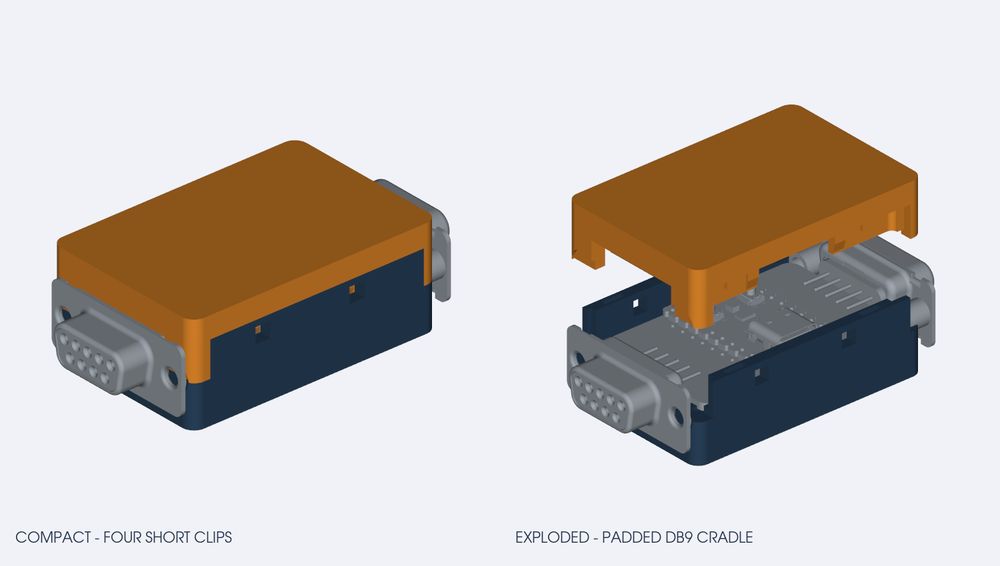

# RetroLink MD 1.10 compact four-clip case

Two-piece PLA enclosure for the [MD revision 1.10 PCB](../retrolink.kicad_pcb),
with a **male DB9 for the Mega Drive controller** and a **female DB9 for the MSX**.
The plastic envelope is **50.19 x 33.50 x 19.70 mm**, exactly matching the current
[USB 1.10 case](../../../usb/1.10/case/README.md).

Four short internal clips, alignment keys, over-travel stops and tight PCB end
stops carry over from USB. There are **no screws or long latches**. USB-C is
enclosed: open the case and lift the PCB as needed for programming.

**Prototype, not physically print-tested or load-rated.** Digital fit checks do
not establish clip durability, connector retention force or compatibility with
every real cable/port housing. Test one complete pair before use on equipment.



## Print files

| File | Purpose |
| --- | --- |
| [Base STL](retrolink-md-1.10-base.stl) | MD bottom half, oriented with its outside face on the print bed. |
| [Lid STL](retrolink-md-1.10-lid.stl) | MD top half, oriented with its outside face on the print bed. |
| [Case STEP](retrolink-md-1.10-case.step) | Two assembled plastic solids for CAD editing. |
| [Generator](md_case.py) | MD connector openings, assembly checks and CLI. |
| [Tests](test_md_case.py) | Ten MD geometry regressions, including exact USB-size matching. |
| [Dependencies](requirements.txt) | Reuses the USB enclosure's pinned CAD dependencies. |

Dimensions are in **millimetres**. Slice at **100% scale**. Use both MD parts
together; the common outside size does **not** make USB and MD halves
interchangeable. The preview includes electronics and rubber pads, but the STL
and STEP exports contain only the plastic case.

## Geometry and connector access

| Feature | Default |
| --- | --- |
| Plastic envelope, excluding exposed connectors | **50.19 x 33.50 x 19.70 mm** |
| PCB | 43 x 28 x 1.6 mm; 2 mm corner radius |
| Shell wall / roof / floor | 2.4 mm, except local pad recesses |
| Individual clip lengths, including roots | 14.7 / 14.1 mm |
| Clip beams / root radius | 1.2 x 4.8 mm / 1.2 mm in the bending plane |
| Clip engagement | 0.20 mm nominal |
| PCB lengthwise allowance | 0.10 mm per end, **0.20 mm total nominal travel** |
| Alignment-key clearance | 0.15 mm per mating face |
| Male DB9 rear-shell opening | 20.4 mm wide x 11.8 mm high |
| Female DB9 rear-shell opening | 20.4 mm wide x 11.9 mm high |
| Programming opening | None; USB-C remains internal |

Both mating flanges and mounting holes stay outside the case, with no plastic
lip in front of either mating face. The two end openings are intentionally
different: the supplied male connector is not a mirror of the female part.
Each end has a low split seam so the populated PCB can be lowered into the base.
The male end also clears its long rear mounting bosses and solder pins.

The main PCB matches the USB outline, but the RP2040 Zero sits **2.835 mm farther
toward the male DB9**. Its adjacent clip over-travel stops are repositioned to
avoid the module substrate. Male-side board end stops also sit away from the
connector's mounting bosses. The PCB supports avoid the diode and pin pads.

### Size excludes protruding connectors

The modeled MD assembly spans approximately **66.68 mm** from one connector tip
to the other. That does not change the 50.19 mm plastic length: the male DB9
projects beyond the end that holds the USB-A socket in the USB version.
Matching case size does not imply matching total adapter length with connectors.

## Connector support and rubber pads

The female **MSX end** retains the USB design's padded metal-backshell cradle.
Fit **two soft nonconductive rubber or silicone strips, 2 x 12 x 1 mm each**:

- Place one under and one above the female connector's rear flat metal shell.
- Use approximately Shore A 20-30 material. Do not substitute hard shims.
- Nominal pad compression is 0.20 mm each; each contact land is 24 mm2.
- Keep pad plus adhesive thickness at 1 mm. Start with a dry fit without pads,
  then check that adding them does not make closing force excessive.

The intended MSX extraction load path is case -> pad friction -> metal shell.
This is **not positive flange capture**. If the pads slip, the PCB and solder
joints can still carry extraction force. Tight PCB end stops do not replace
connector strain relief.

The male **controller end has clearance and PCB locating support, but no padded
grip or claimed extraction strain relief**. Its broad rear metal lands lie
outside the fixed-size enclosure. Do not stuff extra pads around its pins or
mounting bosses. Hold the exposed connector shell when disconnecting a tight
controller plug; do not use the case as a lever. Grip and cycle-life testing
remain necessary on both ends.

## Printing and assembly

Use PLA with a 0.4 mm nozzle and 0.20 mm layers as a starting point:

- Four perimeters, five top/bottom layers and 25-35% infill.
- Keep the supplied print orientations so the short arms run along layers.
- **Local supports are needed under all four horizontal clip arms.** Permit
  supports to start on part surfaces, not only on the print bed; inspect the
  slicer preview. Start with a removable 0.20 mm support-interface gap.
- The approximately 3.1 mm receiver windows should normally bridge, but check
  your printer's capability. Remove supports without bending clips outward.
- Prefer ordinary PLA, not brittle silk/filled blends. Avoid hot environments.

1. Disconnect all cables. Dry-fit the empty halves and verify gentle engagement
   of all four hooks before installing the board.
2. Lower the PCB onto its four support lands, male DB9 at one end and female at
   the other. Both flanges remain outside; do not press on the pins or diode.
3. Fit the two rubber strips at the female MSX end after the unpadded fit is
   satisfactory. Align the stepped ends and alignment keys, then press near each
   clip. Stop if anything binds or a pad holds the seam open.
4. Check all four receiver windows and test plug clearance on unpowered spare
   connectors. Test that the female metal shell does not slide within the case
   under a gentle disconnected hand load.
5. Open by pressing each hook inward through its window with a blunt plastic
   tool and lifting that corner only enough to release it. Do not lever against
   still-engaged hooks or force a clip beyond its internal stop.

The clips are intended for occasional servicing, not repeated flexing.

## Regeneration

The MD source imports shared primitives, short clips, print orientations and
export validation from [the USB generator](../../../usb/1.10/case/case.py).
Keep that folder at its repository-relative location when regenerating; it is
not needed just to print the supplied STLs. This avoids maintaining two diverging
versions of the same clip design.

Python 3.13 was used. From this folder in PowerShell:

```powershell
python -m venv .venv
.\.venv\Scripts\python.exe -m pip install -r requirements.txt
.\.venv\Scripts\python.exe md_case.py
.\.venv\Scripts\python.exe -m unittest discover -s . -p test_md_case.py -v
```

The MD CLI keeps the exterior dimensions fixed. Available fit adjustments:

| Option | Supported range |
| --- | --- |
| `--board-end-clearance` | 0.05-0.20 mm per end |
| `--key-clearance` | 0.12-0.25 mm |
| `--hook-engagement` | 0.15-0.25 mm; lower values reduce both closing force and retention |
| `--pad-compression` | 0.10-0.20 mm per female-end rubber pad |

Use `--output .\trial` for alternative exports without replacing the defaults.
Changes to module mounting height, connector models or outside dimensions need
a new CAD fit review; the MD CLI deliberately does not expose size-changing
parameters.

For full component checks, export MD 1.10 with KiCad 10:

```powershell
$assembly = Join-Path $env:TEMP 'retrolink-md-1.10-fit.step'
& 'C:\Program Files\KiCad\10.0\bin\kicad-cli.exe' pcb export step `
    --force --user-origin '102.15x102.25mm' --output $assembly ..\retrolink.kicad_pcb
.\.venv\Scripts\python.exe md_case.py --assembly $assembly
Remove-Item $assembly
```

The local origin is the PCB lower-left corner, z=0 at its underside; +X points
toward the female DB9 and +Y toward the internal USB-C socket.

Validation covers:

- Exactly the USB default envelope, four short clips and 0.20 mm nominal PCB travel.
- No nominal PCB, half-to-half or supplied MD assembly overlap.
- Populated-board and lid insertion at twelve sampled heights.
- Two different DB9 openings, exposed flanges and a closed USB-C side.
- Shifted-module clearance, solder keepouts, clip release and over-travel stops.
- Two female-end pad lands contacting only the metal backshell.
- Connected, watertight print meshes at bed z=0 and a two-solid STEP round-trip.
- All ten MD tests plus the twelve USB tests after sharing geometry code.

These are geometric checks, not a slicer simulation, material deformation model,
mechanical load test or electrical validation.
