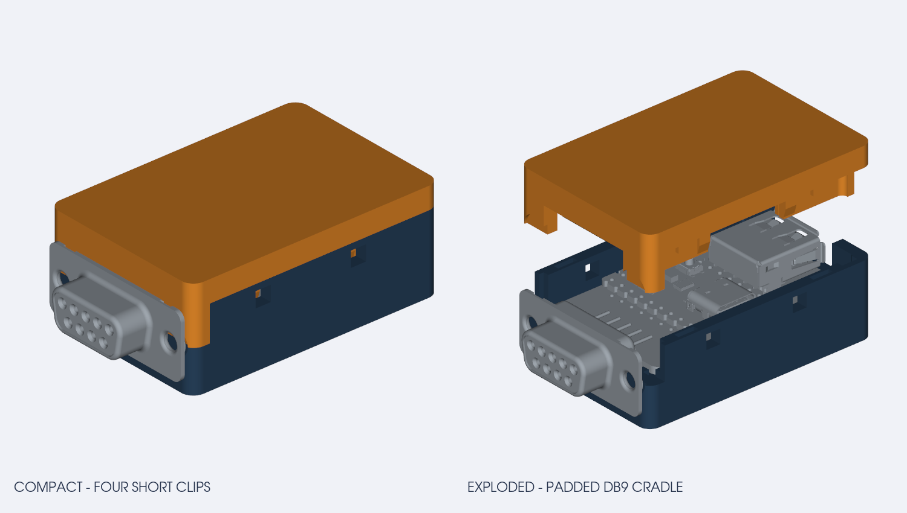

# RetroLink USB 1.10 compact four-clip case

Two printable PLA halves, **four short internal clips**, and the original compact
outline. No screws, nuts, long side latches or PCB drilling. USB-A and DB9 remain
accessible. The USB-C side opening is closed; open the case and lift the PCB as
needed to connect the RP2040 Zero's programming cable.

The first prototype was reported to break at the clip roots during closing.
This redesign addresses the root geometry and required deflection, but **has not
been physically print-tested**. Neither clip strength nor DB9 holding force is
load-rated. Print and test one pair before using it on equipment.



## Files

| File | Purpose |
| --- | --- |
| [Base STL](retrolink-usb-1.10-base.stl) | Bottom half, outside face already on the bed. |
| [Lid STL](retrolink-usb-1.10-lid.stl) | Top half, outside face already on the bed. |
| [Case STEP](retrolink-usb-1.10-case.step) | Two assembled enclosure solids, without electronics or rubber pads. |
| [Generator](case.py) | CadQuery dimensions, exports, rendering and fit validation. |
| [Tests](test_case.py) | Thirteen geometry regressions. |
| [Dependencies](requirements.txt) | Pinned direct Python dependencies. |

Use the current base **and** lid together: they are not interchangeable with
earlier prototypes. The files above replace the experimental large M3 enclosure.
All dimensions are **millimetres**; slice at **100%**, without scaling.

## Compact dimensions and clip changes

| Feature | Current default |
| --- | --- |
| Case envelope, excluding connectors | **50.19 x 33.50 x 19.70 mm** |
| First prototype envelope | 50.00 x 33.50 x 19.70 mm |
| Main PCB | 43 x 28 x 1.6 mm, 2 mm corner radius |
| Wall / roof / floor thickness | 2.4 mm, except local pad recesses |
| Clip count | Four, two per long side |
| Total individual clip length, including root | 14.7 / 14.1 mm |
| Spring beam section | 1.2 mm thick x **4.8 mm tall** |
| Root blend | **1.2 mm concave radius in the XY bending plane** |
| Hook insertion deflection / engagement | **0.20 mm** nominal |
| Hook retention lip height | **1.8 mm** |
| Receiver vertical allowance | 0.15 mm |
| Alignment-key clearance | 0.15 mm per mating face |
| PCB lengthwise allowance | **0.10 mm per end / 0.20 mm total nominal travel** |
| PCB side-to-side / vertical allowance | 0.35 mm per side / 0.20 mm |
| USB-A opening | 17.4 x 8.5 mm; bottom raised 1 mm, top unchanged |
| USB-C side wall | Closed; internal socket clearance retained |

Dedicated stops at both PCB ends reduce the previous 0.70 mm modeled lengthwise
travel without changing the outer dimensions, clip fit or lateral guides. They
contact straight board edges rather than the rounded corners. If the real print
is still loose or too tight, adjust `--board-end-clearance`, not the shell size.
The 0.20 mm target is nominal CAD travel, not a guarantee of printer accuracy.

Compared with the first short-clip prototype, the beams are 50% taller, the hook
lips are deeper, and nominal closing deflection falls from 0.30 to 0.20 mm.
The roots now blend in the **actual bending direction** and extend to the roof,
rather than relying on a fillet in the perpendicular plane. Lead-in ramps ease
closing, internal stops limit accidental over-pressing, and four independent
alignment tongues limit sliding between the halves.

A conservative rectangular-beam screen gives approximately **0.78% strain**,
including 0.15 mm print error, versus approximately 1.02% for the first design.
This is not FEA, a PLA material qualification or proof of strength. Thicker hooks
and larger engagement alone would increase closing force, so do not enlarge them
indiscriminately.

## DB9 support without obstructing the mating face

The **entire flange and mounting holes remain outside the case**. The plastic
stops 0.20 mm behind the modeled rear flange plane; nothing projects in front of
the flange, and there are no screws through its mounting holes. This avoids the
front lip that would obstruct the computer's connector.

A reinforced rear cradle contains two shallow pad recesses against the flat
top and bottom of the **metal backshell**, not against its pins or the PCB.
Fit **two soft, nonconductive rubber or silicone strips, each 2 x 12 x 1 mm**:

- Use soft solid material, approximately Shore A 20-30, not hard plastic, metal
  shims or multiple layers of tape.
- Pad locations are x=44.9..46.9, y=8..20 in the assembly coordinate system.
  The 12 mm direction runs across the DB9 shell.
- Each pad has a nominal **24 mm2 metal contact area**. Its seated thickness is
  0.80 mm when the seam is fully closed: 20% nominal compression.
- Clip take-up can reduce compression; the 0.15 mm receiver allowance must not
  be confused with zero-play screw clamping. Rubber compliance and printer
  tolerances affect the actual preload.
- The recess locates the pad. If adhesive is needed to hold it during assembly,
  keep the **total pad-plus-adhesive thickness at 1 mm**.

Intended extraction load path: **case -> cradle -> rubber friction -> DB9 metal
shell**. The closer PCB end stops are locating features, not connector strain
relief; they can engage before the rear flange backing. This is **not positive
flange capture**: without sufficient pad grip,
the connector can slip and the solder joints can still be loaded. Do not claim
complete strain relief without a physical retention test.

Dry-fit the case **without pads first**. Then add the pads and verify that the
case still closes gently and stays closed. If the pads force the lid open or make
closing substantially harder, stop; use softer material or reduce the modeled
preload. Do not force the clips against an oversized/hard pad.

## PLA printing and assembly

- 0.4 mm nozzle, 0.20 mm layers; four perimeters, five top/bottom layers and
  25-35% infill are starting settings.
- Keep both STLs in the supplied orientations. The beam length runs along
  printed layers. Do not stand the lid on an edge.
- **Use local supports beneath all four horizontal clip arms.** Supports must
  be allowed to start on part surfaces, not only on the build plate. Start with
  a removable 0.20 mm interface gap and inspect the slicer preview.
- The receiver openings are approximately 3.1 mm wide and should normally
  bridge without support. Check your printer's capability.
- Remove support completely from roots, ramps, hooks and locator pockets.
  Use ordinary PLA rather than brittle silk/filled PLA; avoid hot environments.
- Do not scale the whole model to correct fit. Adjust clearances in the source
  or through the CLI and check elephant-foot compensation.

1. Unplug all cables. Dry-fit the two empty halves and gently test each clip.
   All four hooks should engage without a hard squeeze. Never bend a clip outward.
2. Open the case and lower the PCB onto the four support lands, with the DB9
   flange outside. The lower front seam allows the rear metal collars to drop in.
3. Confirm clearance around the diode, solder tails and the module. Fit the two
   rubber pads only after the unpadded fit is correct.
4. Align the stepped DB9 end and locator tongues. Press locally near each clip,
   not hard on the center of the roof. Check all four receiver windows.
5. With the adapter disconnected, verify that the metal DB9 shell cannot slide
   axially inside the case under a gentle hand load. Then test fit on an
   unpowered spare connector before use on the computer. Stop if there is motion.
6. To open, press one hook inward through its window with a blunt plastic tool,
   lift that corner only enough to release it, and repeat. Do not lever the lid
   against still-engaged hooks or push beyond the internal stops.

These clips are for occasional servicing, not repeated flexing.
For programming, disconnect the adapter from the MSX and USB devices, release
the lid, and lift the PCB out of the base as needed for USB-C cable access.

## Source geometry and assumptions

The design uses the [revision 1.10 PCB](../retrolink.kicad_pcb) and its supplied
[STEP models](../libraries/), not screenshot measurements.

- Origin: KiCad X=102.15, Y=102.25 mm, with exported +Y toward USB-C and z=0 at
  the main PCB underside. The enclosure checks the nominal 1.6 mm PCB thickness,
  not just the approximately 1.51 mm exported substrate.
- The module is an **RP2040 Zero**, not a Raspberry Pi Zero SBC. Its modeled
  substrate spans z=3.504..4.595 mm.
- The USB-C envelope is x=19.970..29.550, y=19.511..27.041,
  z=3.685..7.845 mm. It is enclosed with clearance behind the solid side wall.
- The DB9 flat metal pad lands are z=-4.815 and z=6.005 mm; the flange rear face
  is x=47.640 mm. Different connector models need a new fit review.
- The underside keepout reserves 3.2 mm for solder and leads. Header sockets,
  alternate modules and oversized cable overmoulds may require adjustments.

## Regeneration and adjustments

The [MD 1.10 case](../../../md/1.10/case/README.md) reuses this generator's
shell, short clips and export helpers with different connector openings and
support placement. USB defaults and printable geometry are unchanged by this
shared-code extraction.

Python 3.13 was used. From this folder in PowerShell:

```powershell
python -m venv .venv
.\.venv\Scripts\python.exe -m pip install -r requirements.txt
.\.venv\Scripts\python.exe case.py
.\.venv\Scripts\python.exe -m unittest discover -s . -p test_case.py -v
```

The generator overwrites the two STLs, STEP and preview. Use `--output` for
trial settings:

```powershell
.\.venv\Scripts\python.exe case.py --output .\trial --key-clearance 0.20 --hook-engagement 0.15
.\.venv\Scripts\python.exe case.py --output .\board-fit --board-end-clearance 0.05
.\.venv\Scripts\python.exe case.py --output .\softer-clamp --pad-compression 0.10
.\.venv\Scripts\python.exe case.py --output .\raised-module --module-lift 2.0
```

| Option | Range and effect |
| --- | --- |
| `--fit-clearance` | 0.25-0.55 mm shell and PCB side clearance; changes wall position, not the dedicated end stops. |
| `--board-end-clearance` | 0.05-0.20 mm at each PCB end; total nominal lengthwise travel is twice this value. |
| `--key-clearance` | 0.12-0.25 mm locator fit; independent of the clips. |
| `--hook-engagement` | 0.15-0.25 mm; smaller eases closing but reduces retention. |
| `--pad-compression` | 0.10-0.20 mm per 1 mm pad; smaller eases closing but reduces grip. |
| `--flange-clearance` | 0.15-0.25 mm between the rear flange and case backing face. |
| `--module-lift` | 0-6 mm added to the supplied module height; raises the roof for internal clearance. |

To validate the supplied assembly, export a temporary STEP using KiCad 10:

```powershell
$assembly = Join-Path $env:TEMP 'retrolink-usb-1.10-fit.step'
& 'C:\Program Files\KiCad\10.0\bin\kicad-cli.exe' pcb export step `
    --force --user-origin '102.15x102.25mm' --output $assembly ..\retrolink.kicad_pcb
.\.venv\Scripts\python.exe case.py --assembly $assembly
Remove-Item $assembly
```

This rejects unexpected assembly bounds and cannot be combined with
`--module-lift`. The preview includes electronics when an assembly is supplied;
the print files and case STEP always contain **only the two plastic halves**.

Digital checks cover valid connected solids, nominal PCB and component clearance,
sampled PCB/lid insertion, four hook catches and receiver release clearances,
alignment keys, over-travel stops, pad backing and metal-only contact, solder
keepouts, bounded lengthwise PCB travel even at maximum vertical take-up, a solid
USB-C side wall, parameter limits, watertight meshes at bed z=0 and a two-solid STEP
round-trip. Pad compression and inward clip offsets are geometric checks, not
rubber/PLA deformation simulations. Physical closure, durability and retention
tests remain necessary.
